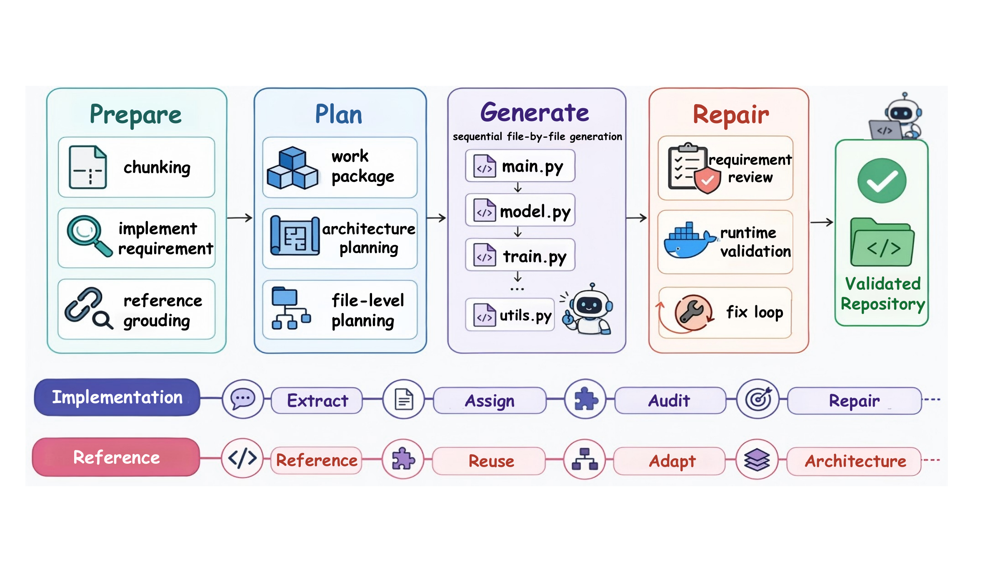
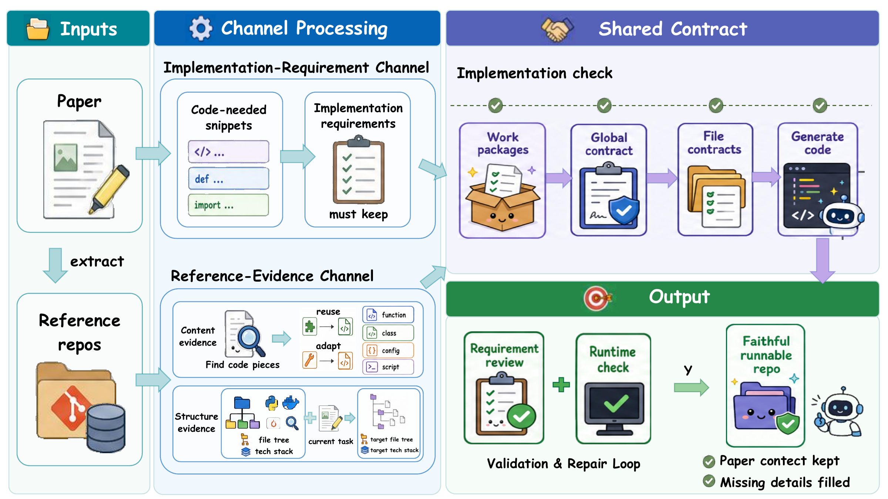

# ReproAgent

ReproAgent is a contract-guided agent pipeline for paper-to-code reproduction. Given a research paper, it generates a runnable repository while preserving the paper-specific methods, protocols, metrics, and artifacts that matter for faithful reproduction.

The core idea is a persistent implementation contract with two channels:

- **Implementation-requirement channel**: extracts explicit paper obligations, such as algorithms, losses, metrics, artifacts, dataset rules, and evaluation protocols, and keeps them visible during planning, generation, and repair.
- **Reference-evidence channel**: retrieves content and structure evidence from related repositories so implicit implementation details, file organization, entry points, and artifact conventions are grounded rather than guessed.

ReproAgent instantiates this contract in a four-stage **Prepare--Plan--Generate--Repair** pipeline. Prepare extracts paper-facing obligations and reference evidence; Plan binds them into work packages and file-level contracts; Generate writes the repository file by file; Repair audits the result against the same contract and runtime feedback.

> Code and experiment artifacts for anonymous review: https://anonymous.4open.science/r/ReproAgent-E760

## Overview





## Main Results

We evaluate on **PaperBench Code-Dev**, which contains 20 ICML 2024 paper-reproduction tasks with repository-level rubrics. Scores are macro-averaged PaperBench percentages over all 20 papers.

### Full-Suite Comparison

| System | Reported score |
| --- | ---: |
| PaperCoder | 45.1 |
| AutoP2C | 49.2 |
| AutoReproduce | 49.6 |
| Deep-Reproducer | 63.2 |
| DeepCode | 73.5 |
| **ReproAgent (ours, Claude-Sonnet-4.5)** | **73.7** |

### Same-Backbone Comparison

All rows below use Gemini-3-Flash, making this the controlled scaffold comparison.

| System | Backbone | Reported score |
| --- | --- | ---: |
| BasicAgent | Gemini-3-Flash | 19.3 |
| IterAgent | Gemini-3-Flash | 20.6 |
| AiScientist | Gemini-3-Flash | 30.5 |
| **ReproAgent (ours)** | **Gemini-3-Flash** | **39.7** |

### Channel Ablations

Both ablations use the same Gemini-3-Flash backbone and the same repair budget as the full Gemini run.

| Setting | Mean | Median | Drop from full |
| --- | ---: | ---: | ---: |
| Full contract | 39.7 | 41.8 | - |
| w/o reference evidence | 21.6 | 21.4 | -18.1 |
| w/o implementation requirements | 25.6 | 24.6 | -14.1 |

The full contract beats both ablations on all 20 targets. This supports the main mechanism: the requirement channel preserves explicit paper obligations, while the evidence channel grounds implicit repository knowledge.

Full per-paper scores, token usage, time, cost, and generated repositories are included in the paper appendix and experiment artifacts.

## Repository Layout

```text
reproagent/                 Core Python package and pipeline implementation.
ablation/
  no_implementation_requirement/
                             Runner for disabling implementation requirements.
  no_reference_evidence/    Runner for disabling reference evidence.
experiment_runners/         Batch runners for the full and ablated variants.
fig/                        README figures.
run_paperbench.py           Main CLI entrypoint.
requirements.txt            Python dependencies.
.env.example                Environment-variable template.
```

## Setup

Create a Python environment and install dependencies:

```bash
python -m venv .venv
. .venv/bin/activate
pip install -r requirements.txt
```

Create a local `.env` from the template:

```bash
cp .env.example .env
```

Fill in the model endpoints used by your run, for example:

```bash
PAPERBENCH_REPRO_NODE_MODEL=gemini-3-flash-preview
PAPERBENCH_REPRO_NODE_API_KEY=...
PAPERBENCH_REPRO_NODE_BASE_URL=...
PAPERBENCH_REPRO_STRUCTURED_STAGE_MODEL=gemini-3-flash-preview
PAPERBENCH_REPRO_STRUCTURED_STAGE_API_KEY=...
PAPERBENCH_REPRO_STRUCTURED_STAGE_BASE_URL=...
```

Reference-evidence search benefits from `PAPERBENCH_REPRO_GITHUB_TOKEN`, but the pipeline can run without it.

## Data

The CLI expects PaperBench-style case folders containing the paper text and metadata. By default it looks under:

```text
paperbench_data/<paper-id>/
```

You can also pass an explicit data root:

```bash
python run_paperbench.py rice --data-root /path/to/paperbench_data --stage generate
```

## Run ReproAgent

Run the full pipeline for one paper:

```bash
python run_paperbench.py rice --stage repair
```

Run only through generation:

```bash
python run_paperbench.py rice --stage generate
```

Use a stable run id:

```bash
python run_paperbench.py rice --run-id main_rice --stage repair
```

Outputs are written under:

```text
output/reproagent/<run-id>/
```

## Resume

Resume generation after an interrupted local-file-generation stage:

```bash
python run_paperbench.py rice \
  --resume-from-run-id main_rice \
  --resume-in-place \
  --resume-start-stage local_file_generation \
  --stage generate
```

Resume repair:

```bash
python run_paperbench.py rice \
  --resume-from-run-id main_rice \
  --resume-in-place \
  --resume-start-stage repair_validation \
  --stage repair
```

## Ablations

Run without implementation requirements:

```bash
python ablation/no_implementation_requirement/run_ablation.py rice --stage repair
```

Equivalent environment switch:

```bash
export PAPERBENCH_REPRO_DISABLE_IMPLEMENTATION_REQUIREMENTS=1
python run_paperbench.py rice --stage repair
```

Run without reference evidence:

```bash
python ablation/no_reference_evidence/run_ablation.py rice --stage repair
```

Equivalent CLI switch:

```bash
python run_paperbench.py rice --no-clone-references --stage repair
```

## Batch Runners

Run all configured PaperBench cases for the main variant:

```bash
bash experiment_runners/run_main_experiment.sh
```

Run all cases for the two ablations:

```bash
bash experiment_runners/run_no_implementation_requirement.sh
bash experiment_runners/run_no_reference_evidence.sh
```

Pass paper ids to run a subset:

```bash
bash experiment_runners/run_main_experiment.sh rice pinn
```

By default the runners execute `--stage repair`. To stop after generation:

```bash
REPROAGENT_STAGE=generate bash experiment_runners/run_main_experiment.sh rice
```

## Artifacts and PaperBench Resources

Generated reproduction repositories are stored separately from the main code branch. For anonymous review, use the artifact link above.

PaperBench resources:

- Benchmark repository: https://github.com/openai/frontier-evals/tree/main/project/paperbench
- Dataset directory: https://github.com/openai/frontier-evals/tree/main/project/paperbench/data
